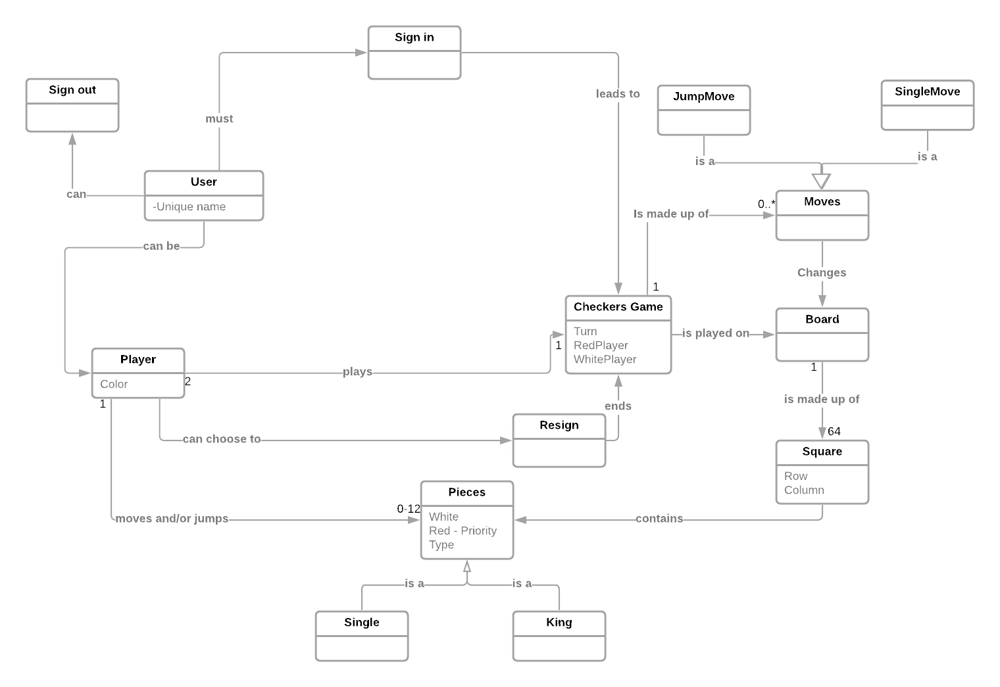
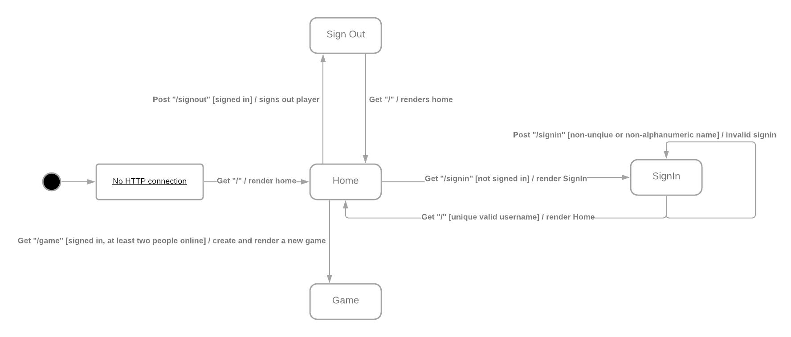

# PROJECT Design Documentation

## Team Information
* Team name: Team 4
* Team members
  * Yaqim Auguste
  * Will Dabney
  * Jim Logan
  * Neel Raj

## Executive Summary

The purpose of this project was to create a working game of checkers that follows the 
american rules. It is played locally on one machine and is done through a web page.

### Purpose

The project is to develop a web application of checkers that allows users to play
a game featuring the ability to perform piece moves, either single, jump, or 
multiple jumps. Additionally, the project has to allow for interact with the 
game page by reverting moves, submitting their moves, or resigning from the game.
Users should also be able to interact with the rest of the application through 
signing in, player selection, and signing out.

### Glossary and Acronyms
> _Provide a table of terms and acronyms._

| Term | Definition |
|------|------------|
| VO | Value Object |

## Requirements

This section describes the features of the application.

The application features include the ability to sign in to and out of the web application, 
select a user to play a checkers game with. Another set of features are movement: 
move pieces regularly or perform a jump or several jump moves. 
Additionally, the application features the ability to back up, or revert, a move before it is submitted, 
submit a move, and resign from the game.

### Definition of MVP
> _Provide a simple description of the Minimum Viable Product._

### MVP Features
> _Provide a list of top-level Epics and/or Stories of the MVP._

### Roadmap of Enhancements
> _Provide a list of top-level features in the order you plan to consider them._

## Application Domain

This section describes the application domain.

A User signs in by entering the login information.
They can sign out, spectate a game or can join a checkers game with another player / AI.
During the game either player may resign which ends the game.
The checkers game is played on a board which is made up of spaces that can be dark or light.
The Spaces can hold pieces; the player can move their corresponding pieces.

## Architecture and Design

This section describes the application architecture.

### Summary

The following Tiers/Layers model shows a high-level view of the webapp's architecture.

As a web application, the user interacts with the system using a
browser. The client-side of the UI is composed of HTML pages with
some minimal CSS for styling the page. There is also some JavaScript
that has been provided to the team by the architect.

The server-side tiers include the UI Tier that is composed of UI Controllers and Views. 
Controllers are created using the Spark framework and View are built using the FreeMarker framework. 
The Application and Model tiers are built using plain-old Java objects (POJOs).

Details of the components within these tiers are below.

### Overview of User Interface

This section describes the web interface flow; this is how the user views and interacts
with the WebCheckers application.

At the start of the web application and the establishment of an HTTP connection, 
the user is immediately greeted with the home page (“/”) with the option to sign-in. 
Clicking the sign-in option then directs the user to the sign-in page (“/signin”) which
displays a text box to input a valid username to sign-in. Once the user is signed in,
they are returned to the home page (“/”) which now displays the list of online players 
and an option to sign-out. Selecting another online user to play a game against then 
takes the user to the game page (“/game”). Once the game is completed, the user is then
returned to the home page (“/”), again with the option to select to play a game from the
list of players or the option to sign-out. Clicking the sign-out option will 
take the user back to the home page (“/”) with the option to sign-in.

When starting a game, the player is directed to one of two states depending on who 
started the game. The player who started the game is directed to the Playing My Turn state, 
where the player can make their move and submit the turn. Submitting their turn moves them 
to the Waiting for My TurnState. The process is reversed for the player who was challenged 
to a game. When entering their respective states either player can select the resign button,
which ends the game and renders the exit button. When clicked, the button then directs the 
players back to the home screen. The exit button also appears whenever the game ends,
such as when one player runs out of pieces, or when a player cannot make any moves.

### UI Tier
> _Provide a summary of the Server-side UI tier of your architecture.
> Describe the types of components in the tier and describe their
> responsibilities.  This should be a narrative description, i.e. it has
> a flow or "story line" that the reader can follow._

> _At appropriate places as part of this narrative provide one or more
> static models (UML class structure or object diagrams) with some
> details such as critical attributes and methods._

> _You must also provide any dynamic models, such as statechart and
> sequence diagrams, as is relevant to a particular aspect of the design
> that you are describing.  For example, in WebCheckers you might create
> a sequence diagram of the `POST /validateMove` HTTP request processing
> or you might show a statechart diagram if the Game component uses a
> state machine to manage the game._

> _If a dynamic model, such as a statechart describes a feature that is
> not mostly in this tier and cuts across multiple tiers, you can
> consider placing the narrative description of that feature in a
> separate section for describing significant features. Place this after
> you describe the design of the three tiers._

### Application Tier
> _Provide a summary of the Application tier of your architecture. This
> section will follow the same instructions that are given for the UI
> Tier above._

### Model Tier
> _Provide a summary of the Application tier of your architecture. This
> section will follow the same instructions that are given for the UI
> Tier above._

### Design Improvements
> _Discuss design improvements that you would make if the project were
> to continue. These improvement should be based on your direct
> analysis of where there are problems in the code base which could be
> addressed with design changes, and describe those suggested design
> improvements. After completion of the Code metrics exercise, you
> will also discuss the resutling metric measurements.  Indicate the
> hot spots the metrics identified in your code base, and your
> suggested design improvements to address those hot spots._

## Testing
> _This section will provide information about the testing performed
> and the results of the testing._

### Acceptance Testing
> _Report on the number of user stories that have passed all their
> acceptance criteria tests, the number that have some acceptance
> criteria tests failing, and the number of user stories that
> have not had any testing yet. Highlight the issues found during
> acceptance testing and if there are any concerns._

### Unit Testing and Code Coverage
> _Discuss your unit testing strategy. Report on the code coverage
> achieved from unit testing of the code base. Discuss the team's
> coverage targets, why you selected those values, and how well your
> code coverage met your targets. If there are any anomalies, discuss
> those._
