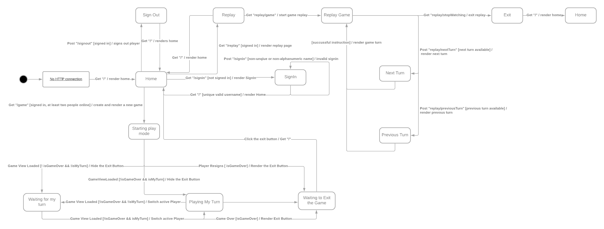
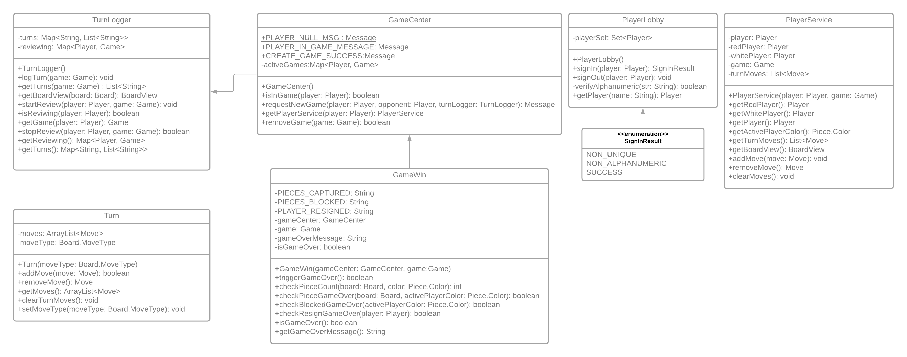

# PROJECT Design Documentation

## Team Information

* Team name: Team 4
* Team members
    * Yaqim Auguste
    * William Dabney
    * Jim Logan
    * Neel Raj

## Executive Summary

The purpose of this project was to create a working game of checkers that follows the american rules. It is played
locally on one machine and is done through a web page.

### Purpose

The project is to develop a web application of checkers that allows users to play a game featuring the ability to
perform piece moves, either single, jump, or multiple jumps. Additionally, the project has to allow for interact with
the game page by reverting moves, submitting their moves, or resigning from the game. Users should also be able to
interact with the rest of the application through signing in, player selection, and signing out.

### Glossary and Acronyms

| Term | Definition |
|------|------------|
| AI | Artificial Intelligence |
| CSS | Cascading Style Sheet |
| HTML | HyperText Markup Language |
| HTTP | HyperText Transfer Protocol |
| JaCoCo | Java Code Coverage |
| JUnit | Unit Testing Framework |
| MVP | Minimum Viable Product |
| POJO | Plain Old Java Object |
| UI | User Interface |

## Requirements

This section describes the features of the application.

The application features include the ability to sign in to and out of the web application, select a user to play a
checkers game with. Another set of features are movement:
move pieces regularly or perform a jump or several jump moves. Additionally, the application features the ability to
back up, or revert, a move before it is submitted, submit a move, and resign from the game.

### Definition of MVP

The application must allow players to play checkers with other players who are currently signed-in. The game user
interface (UI) will support a game experience using drag-and-drop browser capabilities for making moves. Either player
is able to resign from the game.

### MVP Features

The list of MVP features is below.

- Sign-in
- Start a Game
- Validate Move
- Submit Turn
- Backup Move
- Check Turn
- Resign Game
- Simple Move
- Jump Move
- Chain Jump
- King Piece
- Win Conditions

### Roadmap of Enhancements

The list of enhancements is below.

- Sign Out
- Replaying A Game

## Application Domain

This section describes the application domain.

A User signs in by entering the login information. They can sign out, spectate a game or can join a checkers game with another player / AI. During the game either player may resign which ends the game. The checkers game uses a board, which is made up of spaces that can be dark or light, to play the game. The Spaces can hold pieces; the player can move their corresponding pieces. After a game is done the user can review the game.

## Architecture and Design

This section describes the application architecture.

### Summary

The following Tiers/Layers model shows a high-level view of the webapp's architecture.

As a web application, the user interacts with the system using a browser. The client-side of the UI consists of HTML
pages with some minimal CSS for styling the page. There is also some JavaScript that has been provided to the team by
the architect.

The server-side tiers include the UI Tier that is composed of UI Controllers and Views. The Spark framework creates
Controllers, and the FreeMarker frameworks builds the View. The Application and Model tiers contain plain-old Java
objects (POJOs).

Details of the components within these tiers are below.

### Overview of User Interface

This section describes the web interface flow; this is how the user views and interacts with the WebCheckers
application.

At the start of the web application and the establishment of an HTTP connection, the user is immediately greeted with
the home page (“/”) with the option to sign-in. Clicking the sign-in option then directs the user to the sign-in page (
“/signin”) which displays a text box to input a valid username to sign-in. Once the user is signed in, they are returned
to the home page (“/”) which now displays the list of online players and an option to sign-out. Selecting another online
user to play a game against then takes the user to the game page (“/game”). Once the game is completed, the user is then
returned to the home page (“/”), again with the option to select to play a game from the list of players or the option
to sign-out. Clicking the sign-out option will take the user back to the home page (“/”) with the option to sign-in.

When starting a game, the player is directed to one of two states depending on who started the game. The player who
started the game is directed to the Playing My Turn state, where the player can make their move and submit the turn.
Submitting their turn moves them to the Waiting for My TurnState. The process is reversed for the player who was
challenged to a game. When entering their respective states either player can select the resign button, which ends the
game and renders the exit button. When clicked, the button then directs the players back to the home screen. The exit
button also appears whenever the game ends, such as when one player runs out of pieces, or when a player cannot make any
moves.

After a game is completed, the player is directed back to the home screen, and from there they can select the replay 
link in the navigation bar. From there, they can select a game that was previously played. Selecting the link brings the 
player to the game, where the only options they have are to press three buttons. Pressing the next button advances the 
game along one turn. Pressing the previous button precedes the game one turn. Pressing the exit button returns the 
player to the home screen. If there are no turns following or preceding the current turn, then the respective buttons 
are unable to be pressed.

### UI Tier

The UI tier of the application contains all the HTTP view components for the webserver. The first route that is called
is the GetHomeRoute, which gives all the information about the home screen to the web server for it to be rendered. From
the homescreen, the user can check any messages that the server displays, but more importantly, the player can click the
sign in button in order to access the GetSignInRoute. The flow between these two states can be seen above in the state
diagram for the application. The user can then sign in with a unique and appropriate username. which calls the
PostSignIn route, which tailors the appropriate response based on the name entered. If the name is successful, the
server redirects to the homescreen, but with additional information displayed, such as the ability to sign out, which is
performed with PostSignOut.

By selecting another player’s name, a game can be issued, and GetGameRoute is called in one of two states, waiting for a
turn, and performing a turn. Performing a turn starts at GetGameRoute, where the player can move a piece to an open
spot. When this happens, it calls PostValidateMove which ensures that the move is able to be made, and sends a message
of type INFO to the server if the move is valid, or sends a message of type ERROR to the server if the move was invalid.
From there, the user can use one of two buttons. The first button is the Back button, which then calls PostBackupMove.
PostBackupMove reverses the game back one move. The Player can also press the Submit Turn button. By pressing the
button, the player submits their turn to the game, and the route sends a message of type INFO if successful, and ERROR
if the moves were unsuccessful, such as the case where jump moves were possible.

While the player is performing their turn, the other player is in the Waiting for My Turn state. Using PostCheckTurn,
every five seconds the game queries as to whether it is the player’s turn. The route returns a message of type INFO with
the message “true” or “false” depending on if it is the player’s turn. If the message is “true,” then GetGameRoute is
called, and the turn switches.

At any point the player can select the resign button, which triggers the end of the game using PostResignGame.

When the replay button in the navigation bar is pressed, the game calls GetReplayPageRoute, which holds a list of all
of the completed games that were played during the session. When any one of these games are selected, GetReplayGameRoute 
is called and the game is loaded to be replayed. Within this UI there are three button that do three different things. 
The first button is the next button, and if there are still turns that can be reviewed, the button would be able to be
pressed. When pressed, the PostReplayNextTurnRoute is called and the next turn is loaded. This is the case with the previous
button as well. When pressed, PostReplayPreviousRoute is called and the previous turn is loaded. The last button is the
exit button. When pressed, it calls the GetReplayStopWatchingRoute and removes all information about the player replaying
a game and redirects to the home screen.

### Application Tier

The application tier consists of five classes that provide services to the UI tier: GameCenter, PlayerLobby, GameWin,
PlayerService, and TurnLogger. Each of these classes play a central role in the flow of the application. GameCenter is 
the class that controls and keeps track of active games and which players are in a game. It has methods to request a 
new game withspecific players, and is able to create a PlayerService application tier class. The PlayerService class holds
information specific to the player. For instance, there are methods that add moves to a list for the player’s current
turn. On the simpler side of the application tier components there is PlayerLobby. PlayerLobby simply keeps track of
players that are signed in to the web server, and makes sure that no duplicate or invalid names are present. The next
application tier class is GameWin. GameWin contains the functionality to trigger the end of a game. It contains multiple
methods relating to the way a game can end, such as no valid moves able to be made, no pieces on the board, or
resignation. TurnLogger logs all of the board configurations at the end of each turn. Because of this, TurnLogger allows
for games to be replayed at a later time. The final application tier class is Turn, which holds all of the moves for the
current turn of the game.

### Model Tier

The model tier consists of 13 classes that make up different aspects of the game: Position, Move (JumpMove and
SingleMove), Piece (SinglePiece and King), Space, Row, Board, Boardview, Game, and Player. Across these classes, the
model holds information about the web application’s state and helps communicate that to the other tiers.

Position holds location information, specifically a row and column location value. There are two types of Moves,
JumpMove and SingleMove. Move contains two Position objects: a start Position and an end Position. A SingleMove does not
extend the Move functionality, but is useful due to the possibility of JumpMoves. JumpMove extends the Move
functionality by having another Position that represents the space that is being jumped over.

There are two types of Pieces, a SinglePiece and a King, both of which extend the functionality of the Piece class.
Piece is an abstract class that contains a piece’s type and color; it has two methods to determine a Piece’s possible
SingleMoves and JumpMoves. Space holds information on its location on a checkerboard, if a Piece is on it, and if it is
a valid Space for a Piece to be placed on it.

Row consists of eight Spaces and is used by the Board to help build an iterator used in BoardView. Board contains most
of the logic of the model. It holds both the players’ pieces on 64 spaces that make up the checkerboard. Additionally,
it handles the various forms of moving pieces and the process of communicating if a move is valid and if it was made
successfully. Moreover, through the GameWin class in the Application tier, it helps determine if the win conditions are
met. BoardView serves as the Board class’ communicator to the UI tier, sending the information being held in the board
to the UI to display the correct orientation of a board with the appropriate colored pieces.

Game is responsible for holding information about the players, the GameCenter that is holding the game, and for
monitoring the status of the game. The Player represents a Player on the web application, holding the player’s name.

### Design Improvements

The team has decided on several design would be beneficiul improvements. The Board class is currently at above 500 lines of code. As a result, the size of the Board class leads the team to conclude that many of the assigned responsibilities of Board can be reassigned to other classes. Specifically, the validation functionality for moves can be moved to the respective move classes.

The model tier has 13 different classes which leads the team to conclude that it is possible that some of the classes as well as their assigned functionality could be relocated.

Moreover, the team’s architectural separation can be improved on. The Model should be responsible for maintaining and holding information about the game. There are instances in the Model where there is information being communicated to the UI whereas the Application should be handling that.

## Testing

As of the end of Sprint 3, all nine user stories (two from Sprint 3 five from Sprint 2 and two from Sprint 1) have all met their acceptance criteria tests. None have failed their acceptance criteria. All user stories have been tested.

### Acceptance Testing

As of the end of Sprint 2, all seven user stories (five from Sprint 2 and two from Sprint 1) have all met their
acceptance criteria tests. None have failed their acceptance criteria. All user stories have been tested.

There is one issue that has arisen during acceptance testing. In the user story, _Making a Jump Move_, when making a
multiple jump move, there is an issue, both on the Model and UI side. In the model, the board updates even when the
multiple jump has not been completed. On the UI side, the only way multiple jumps work is if the player submits a turn
every jump move. Although in the acceptance criteria the multiple jumps does work, the current implementation does call
for improvement so that the player does not have to submit a turn for every jump. As a result, this causes a slight
issue with the backup feature in the _UI_ user story.

### Unit Testing and Code Coverage

For each Unit test, the person who wrote the class and methods would be the person to test them. We would test for
return values and any changes that occurred when each method was tested. As we wrote new methods and refactored other
methods we would try as soon as possible to fix the tests to accommodate for the changes. As a team we established that
we wanted to have 90% coverage for the server and each individual component in order to ensure proper functionality.
Some anomalies that occurred with testing happened with switch statements, as all branches were unable to be covered due
to a lack of need for a default case. As it stands right now, our code coverage is currently at 90%.